# Documentation – LED-Monitor-Animation

## About

Each image shows something that is much larger in reality. A landscape, a room, or something similar. We wanted to convey the feeling that the world continues beyond the edges of the image.

## Usage

### Step-by-step instructions

If you're wanting to recreate this project, you first must acquire some hardware you might not already have. In addition to a router and some LED strips, you also need a Pixlite platine with a power supply for it. Once everything is plugged in correctly you need to switch over to TouchDesigner.

#### Touchdesigner 

1. Download the TouchDesigner project file  
Download the provided TouchDesigner file from this repository.

2. Check asset paths  
Open the project in TouchDesigner and make sure all assets (videos, images) from the `/assets` folder are correctly linked.  
If something is missing, relink the files manually using the File parameter of the corresponding TOP nodes.

3. Content selection (top left – "content" section)  
In this section you can see different content sources:
- `dancing_woman` (video TOP)  
- `video` (video TOP)  
- `liquid_colors` (generated visuals)

All sources are routed into a **Switch TOP**.  
This allows you to change the active content by switching the index parameter of the Switch TOP.

The selected signal is passed through a **Null TOP (`null_content`)**.  
This node acts as a clean output reference for the whole content pipeline.

4. Window output  
The content is sent to `window1`, which displays the final image on the monitor.

5. Pixel mapping section  
This section extracts color information from the edges of the video:

- `line_top`
- `line_bottom`
- `line_left`
- `line_right`

These TOPs sample the outer edges of the video image.  
They are merged and processed to create a 1D pixel strip representation that matches the physical LED layout.

6. Data conversion (DMX preparation)  
The image data is converted into numeric values:

- Shuffle / Function / Math nodes  
- Values are remapped from 0–255 (RGB) to DMX ranges  

This prepares the data for Art-Net transmission.

7. DMX / Art-Net output  
The processed data is sent to the **DMX Out** node.

⚠ Important  
You must change the **IP address** inside the DMX routing table:

- Set the IP to match your Pixlite controller  
- This is mandatory for the LEDs to receive data

The system uses Art-Net to transmit color values to the LED controller.

8. Final check  
If everything is connected correctly:
- Content appears on the monitor  
- LEDs react to the colors at the screen edges  
- The image visually extends into the surrounding space

### Content creation

#### Dancing Woman

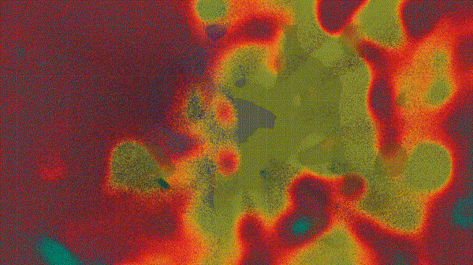

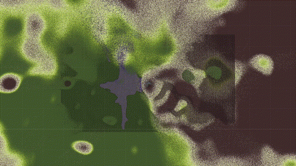

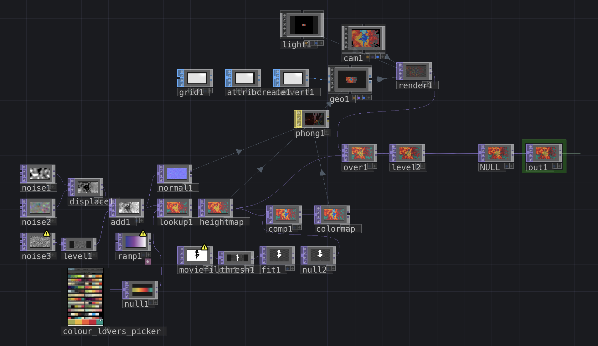

We created this content with the help of online tutorials.  
The visual shows a dancing silhouette that is merged with abstract, flowing colour patterns. The result is a hybrid between a recognizable human figure and a constantly shifting digital texture.

Visually, the content appears organic and dynamic. The dancer remains visible, but is partially distorted by colourful noise fields, gradients and fluid transitions. This creates a dreamlike effect, where the body seems to dissolve into the surrounding colours.

Technically, a video of a dancer is processed and combined with generated noise patterns. Different layers are blended together and manipulated using displacement and colour mapping techniques. This allows the silhouette to stay readable while still being strongly influenced by the abstract visuals.

The main colour of the animation can be changed using the **colour picker** inside TouchDesigner.  
This makes it possible to quickly adapt the visual mood and match the content to different lighting concepts or event settings.

The goal of this content is to combine movement and digital abstraction, creating a lively and expressive animation that reacts well to the LED extension around the screen.

#### Liquid Colors

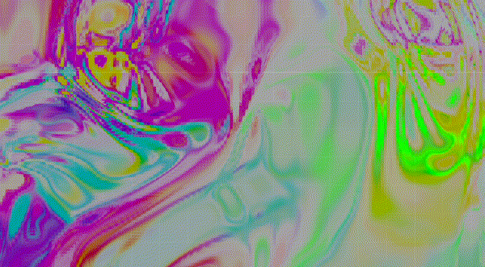

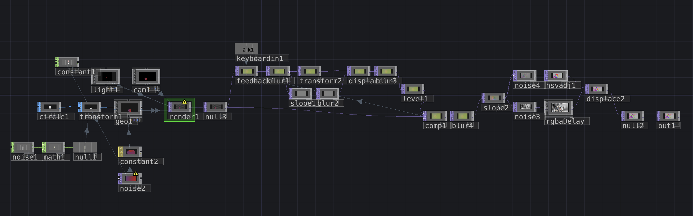

This content was also created with the help of online tutorials.  
It focuses on abstract, fluid colour movements that continuously morph and flow across the screen.

The animation resembles liquid paint or heat maps, with strong colour contrasts and soft transitions. The colours move slowly and organically, creating a calm but constantly evolving visual atmosphere.

From a technical perspective, this content is generated using noise patterns, feedback loops and colour adjustments. By layering and feeding the image back into itself, smooth motion trails and evolving shapes emerge over time.

This content works especially well for ambient lighting, as the dominant colours at the screen edges change constantly and translate nicely to the surrounding LEDs.

#### Video

This content allows any external video file to be used as a visual source.  
The video can be easily replaced, making this content highly flexible for different use cases and events.

By simply changing the file path, any custom video can be loaded into the system. This enables quick adaptation without modifying the TouchDesigner network itself.

This option is ideal for showcasing prepared video material, event-specific visuals or experimental clips that should be extended through the LED setup.

### Diagrams

#### A: Software Diagram

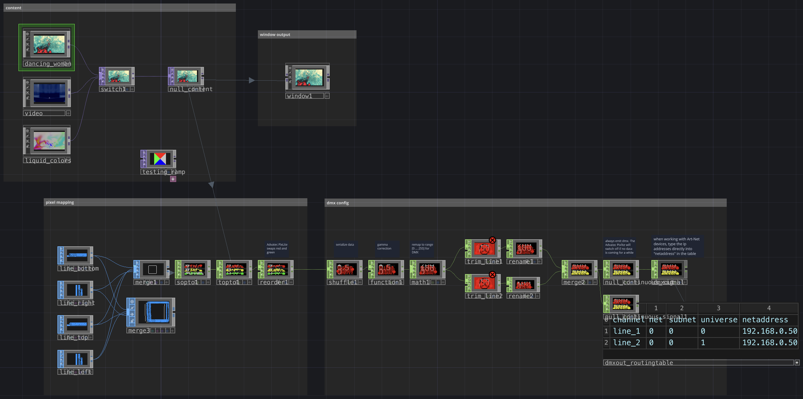

The software diagram represents the TouchDesigner node network.
It shows how video content is routed, processed, mapped to LED pixels and finally sent via Art-Net to the hardware controller.

#### B: Hardware Diagram

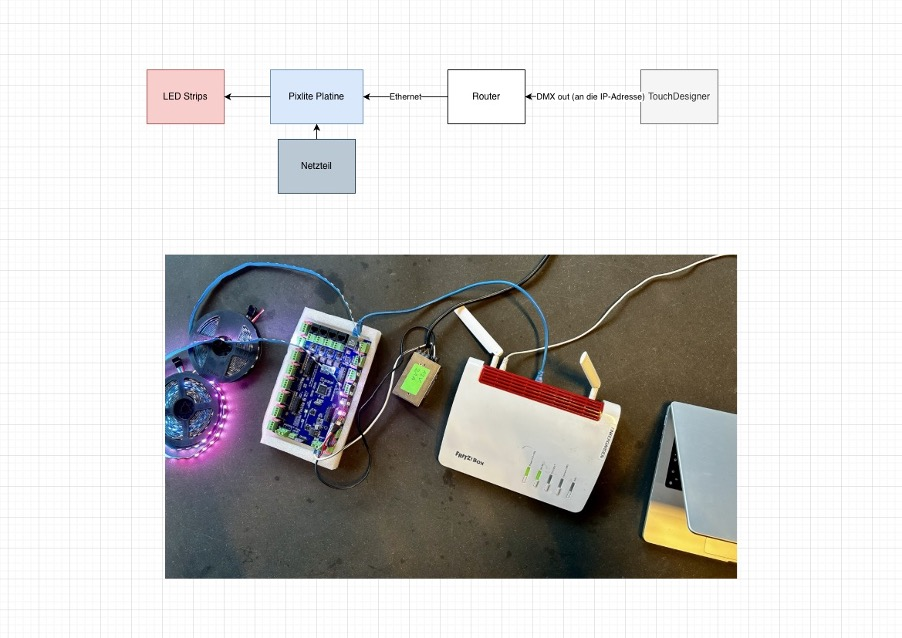

#### C: Communication

This diagram illustrates how the different system components communicate with each other.

TouchDesigner acts as the central control unit.  
It processes the visual content, extracts colour information and sends DMX data via Art-Net to the LED controller.

The Pixlite controller receives this data and forwards it to the LED strips, which then display the corresponding colours.

Small communication overview:

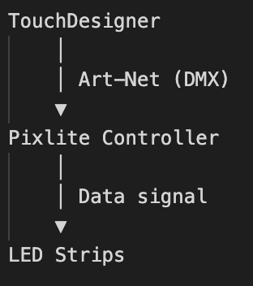

Important:  
The IP address in TouchDesigner must match the IP of the Pixlite controller.  
Otherwise, no data transmission will occur.

### Screenshots and pictures of the project

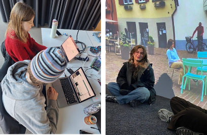

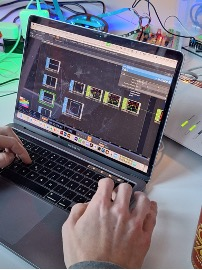

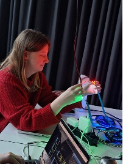

## Reflection

We had a few ideas that we were unable to implement, such as projecting directly onto the meadow at Polentahügel, animating individual elements in the bar with a projector, or the so-called Strobo-Toi. Unfortunately, we couldn't realize the latter because the Polenta OK has not yet agreed on whether to use the same eco-toilets again. Since these are rented, it is not permitted to drill into the wood or make any other permanent changes.

For this reason, we wanted to build our own roof, but we would have needed exact measurements for this. However, these vary depending on the company. We therefore decided to implement something that is primarily suitable for our course and to postpone the implementation of a projection for Polenta 7000 until the next semester.

This gave us the idea of hinting at the world outside the edge of the image, thereby creating the illusion of a larger image.

### A: Planning and development process

During the first minor days, Polenta7000, the Werkstatt, as well as several other locations and a bar were introduced to us. Afterwards, we came together for a brainstorming session. Many different ideas emerged during this process, but it quickly became clear that we wanted to realise a project specifically for Polenta7000.

Throughout the brainstorming phase, we collected a wide range of concepts:

- Mapping projections on the stage
- Visual announcements
- Visual interventions on wooden slat surfaces
- Mapping projections on the Büvetta sign
- Mapping projections on the Büvetta fabric
- Visual design of the chill out area
- Projections onto hills
- Visual interventions on wooden fences, slats, and boards
- Visual content for rave and techno events, adapted to the music
- Interactive stars projected onto pathways, disappearing or bursting when stepped on, guiding visitors on their way home
- Event specific content such as lotto, ping pong, or dating style games, including animated surface design
- 3D printed objects used as projection surfaces indoors
- Projections inside toilet units, at the bar, or at food distribution areas

Ultimately, we decided on the idea of creating a projection inside a toilet unit. This decision was mainly influenced by the lighting conditions. Since Polenta7000 takes place during the summer and runs from the afternoon until 11:00 pm, the sun does not set until around 10:00 pm. As a result, projections would not be very visible during the early evening hours. In contrast, a closed and dark space such as a toilet unit allows projections to be displayed effectively regardless of daylight conditions.

### B: Challenges, rejected solutions, failures and re-planning

At Polenta7000, however, they do not use the conventional plastic porta potties, but eco toilets rented from an external company. This means that no structural interventions such as drilling or other permanent modifications are allowed. Our solution was to design a second, removable roof. Since the eco toilets are made of wood, this approach made it possible to avoid altering the existing structure. The roof would have been built by a carpenter and would have served as a mounting structure for a projector. The projector would have been protected by a metal grid and plexiglass, ensuring that even slightly intoxicated visitors would not pose a risk to our installation. The projection would have been directed onto the toilet door, showing animations such as announcements, band specific content, or event specific projections, for example for a lotto event.

However, the situation developed differently than expected. For a long time, it was unclear which toilets would ultimately be used or whether Polenta7000 would purchase their own units. As a result, we increasingly found ourselves under time pressure, as we could not wait indefinitely for a final decision. For this reason, we came together for another brainstorming session to develop a project that could be realised within the remaining time for Creative Technology, but independently of Polenta7000. We are keeping the option open to implement the Strobo Toilet at a later point or to pass the concept on to a future Creative Technology group.

Our final idea emerged from the observation that content displayed on screens appears much smaller than it does in real life. This led us to ask how a small image can be made to appear larger and, as a result, more realistic. At the same time, the concept needed to be feasible within the Medienhaus and require no major external resources, relying only on what was already available to us.

From these considerations, the idea of combining a monitor with its surrounding room lighting emerged, or more precisely, an extended ambient lighting concept. The goal was to expand the image content beyond the physical boundaries of the screen and into the surrounding space. This was intended to create a stronger visual impact, making the image appear larger and more immersive. The concept is realised using LEDs mounted on the back of the monitor, which react to the content displayed on the screen. The colours at the edges of the monitor are extended through the LEDs, visually expanding the image into the room.

### C: Task distribution

During the ideation all three members of the team were involved in finding a fun project idea for Polenta. As Adrian already knew Jen from the Polenta team, he organized a meeting with her where we could share our idea. Nadja was in contact with a carpenter who would build the roof for the Strobo-Toi, before we had to rethink our idea. Once we realised that we wouldn't be able to accomplish the Strobo-Toi in time, we brainstormed some more and, once we figured out our new project, distributed the work accordingly. Adrian had previously worked with TouchDesigner and was therefore the guy who connected nodes and organized the hardware. Stephanie figured out what we would show on the monitor, found tutorials and helped with the hardware. In the meantime, Nadja documented the entire process by taking pictures and screenshots and keeping track of what we did when.

### D: Learning effect

TouchDesigner is an awesome tool with many possibilities – some of which we were able to learn through this project.  
Throughout the process, we realised how endless the creative and technical options within TouchDesigner really are. The software offers a wide range of tools for real-time visual design and generative content creation.

By following online tutorials and experimenting with different node networks, we gained a deeper understanding of how noise, feedback loops, displacement and colour mapping work together to create dynamic visuals. Step by step, we learned how small parameter changes can strongly influence the overall look and mood of an animation.

TouchDesigner is a very extensive and powerful program. At the beginning, it is necessary to watch several tutorials in order to understand the workflow and structure of the software. However, once the basics are understood, working with TouchDesigner becomes highly rewarding.

Especially the interactive control of parameters, such as colour adjustments, helped us to adapt the visuals to different moods and lighting concepts. This showed us how creative coding can be combined with artistic experimentation.

Overall, the learning curve is steep, but the creative freedom and real-time possibilities make the effort worthwhile.

The hardware was also new to us. We learned the basics of how to use a Pixlite platine and how it works, as well as which plug we should plug in where, which is not as intuitive as it might sound.

### E: Tools

We used a wide range of tools to realise this project.

For the visual programming and real-time content generation, we mainly worked with **TouchDesigner**. It was used to create generative visuals, process video material, map pixel data and control the LED output via Art-Net.

For hardware control, we worked with a **Pixlite LED controller**, which enabled us to send DMX data to the LED strips.

During the documentation process, we used **Draw.io** to create software and hardware diagrams.  
For image and media editing, we used common design and video tools to prepare screenshots, GIFs and visual material for this documentation.

Additionally, we used **GitHub** to manage the project repository and to share files, assets and documentation within the team.

These tools allowed us to efficiently combine creative coding, hardware interaction and structured documentation in one workflow.

### F: Known bugs

During the implementation phase, we encountered limitations related to the hardware setup.  
We decided to use a large monitor, which increased the required length and brightness of the LED strips.

Unfortunately, the LED strips we used were not powerful enough to evenly surround the entire screen. As a result, the brightness and colour intensity were not fully consistent around the monitor edges, especially in brighter ambient lighting conditions.

For future iterations, we would recommend either using a smaller monitor or choosing more powerful LED strips with higher brightness and better colour reproduction. This would ensure a more immersive effect and a cleaner visual extension of the screen content into the surrounding space.

Despite this limitation, the setup still worked as intended and provided valuable insights for future hardware decisions.

## Initiative

Recognition of special achievements / efforts (alongside project making, coachings, ...) (+ max 3)

We would like to implement something else for Polenta 7000 in the summer and have planned to realise our Strobo-Toi.

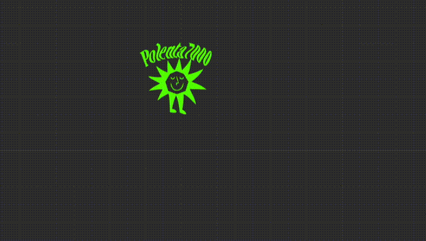